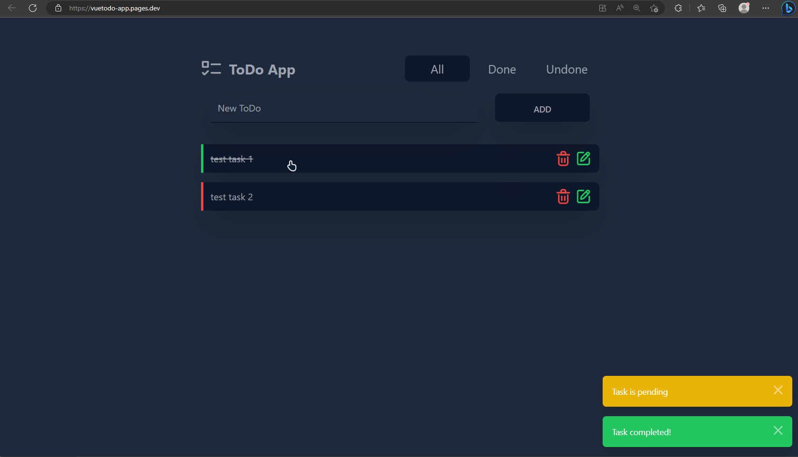
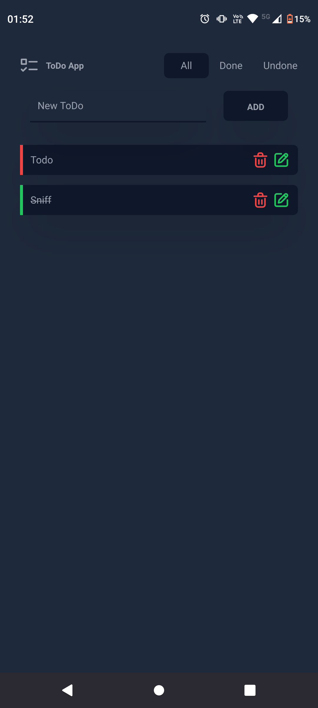

# ToDo App

> This is an Progressive web app (PWA) for your to-do list, which includes adding, deleting, editing, and such features.

### This application is made using Vue 3 Composition API in plain HTML5 and configured as PWA

### **Application features:**

- add todo
- delete todo
- edit todo
- flag todo (done/undone)
- filter todo list (all/done/undone)
- install as native app (PWA)

\*_Responsive project._

## Results

**Access a demo of the project [here](https://vuetodo-app.pages.dev/)**

### Desktop view

<code></code>

### Mobile view

<code></code>

## Next Steps

- [x] basic operations (add, delete, edit)
- [x] filter list by tabs
- [x] make app a PWA
- [x] implement a dark and light theme switcher
- [ ] develop drag and drop todos (to organize by priority)
- [ ] publish to play store / app store

# Installation

### To install `ToDo App` on your system, just enter the following command, enter the project folder and open "index.html" :

```bash
git clone https://github.com/caiquegaspar/todoapp-vuetailwind.git
```
